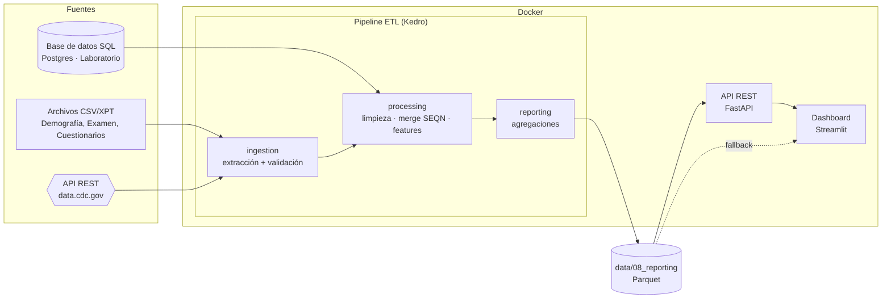

# Arquitectura del Sistema

## Visión general

Solución **end-to-end** de análisis de datos de salud (NHANES Pre-Pandemic 2017-2020) que
integra **tres fuentes de datos**, las procesa con un pipeline ETL y expone los
resultados vía una API REST y un dashboard interactivo, todo orquestado con
Docker.

## Componentes

| Componente | Tecnología | Carpeta | Responsabilidad |
|------------|-----------|---------|-----------------|
| Pipeline ETL | Kedro 1.4 + pandas | `src/prueba/` | Integrar, validar, transformar |
| Base de datos | PostgreSQL 16 | `docker/` | Almacén de la fuente de laboratorio |
| API REST | FastAPI + Uvicorn | `api/` | Servir indicadores como JSON |
| Dashboard | Streamlit + Plotly | `dashboards/` | Visualización por audiencia |
| Orquestación | Docker Compose | `docker/`, raíz | Levantar todo el stack |

## Flujo de datos (capas Kedro)

| Capa | Dataset | Descripción |
|------|---------|-------------|
| `01_raw` | `raw_*` | Datos crudos de las 3 fuentes |
| `02_intermediate` | `int_clinical_merged` | Unión por `SEQN` |
| `03_primary` | `prm_cardiometabolic` | Dataset limpio con features |
| `08_reporting` | `rpt_*` | Tablas agregadas para negocio |

## Las tres fuentes de datos

1. **Archivos planos (CSV/XPT)** — Demografía (`DEMO_J`), examen físico
   (`BMX_J`, `BPX_J`) y cuestionarios (`DIQ_J`, `BPQ_J`, `SMQ_J`, `PAQ_J`).
   Resueltos por `pandas.CSVDataset` en el catálogo.
2. **Base de datos SQL (PostgreSQL)** — Resultados de laboratorio sembrados por
   `docker/seed_db.py`. Leídos con `pandas.SQLQueryDataset`.
3. **API REST (data.cdc.gov / Socrata)** — Indicadores de obesidad por estado,
   descargados por `utils/io_sources.py` con reintentos.

## Decisiones de diseño

- **Kedro** aporta catálogo declarativo, separación de capas y reproducibilidad
  sin escribir orquestación a mano → suma en "organización y reproducibilidad".
- **Parquet** en capas intermedias por eficiencia y tipado.
- **API como capa de desacople**: el dashboard consume la API; si está caída,
  cae a leer Parquet (degradación elegante).
- **Variables de entorno** para toda la configuración sensible (12-factor).
- **Healthchecks** y `depends_on` con condiciones para un arranque ordenado.
